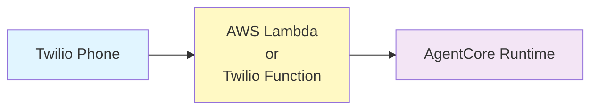

# TAC AgentCore Deployment

Deploy Twilio Agent Connect with AWS Bedrock AgentCore. Choose between two deployment options for webhook handling.

## Architecture



## Deployment Options

### Option 1: AWS Lambda (Recommended)
- ✅ AWS-native serverless
- ✅ No additional Twilio costs
- ✅ Integrated with AWS ecosystem
- 📁 See [aws_lambda/README.md](aws_lambda/README.md)

### Option 2: Twilio Function
- ✅ Everything in Twilio
- ✅ Simplified setup (fewer AWS resources)
- ✅ Lower cold start latency
- 📁 See [twilio_function/README.md](twilio_function/README.md)

## Prerequisites

- **AWS Account** with Bedrock model access
- **AWS CLI** installed and configured with a named profile:
  ```bash
  # Configure a new profile
  aws configure --profile your-profile-name
  
  # Set as default for this session
  export AWS_PROFILE=your-profile-name
  ```
  See [AWS CLI Configuration](https://docs.aws.amazon.com/cli/latest/userguide/cli-configure-profiles.html) for details.
- **Node.js 20+** for CDK
- **Docker** running (for Lambda deployment)
- **Twilio CLI** (for Twilio Function deployment)

### Bootstrap CDK (One-Time Setup)

All deployments use AWS CDK. Bootstrap your AWS account once:

```bash
AWS_PROFILE=your-profile npx cdk bootstrap aws://YOUR_ACCOUNT_ID/REGION
```

This creates:
- S3 bucket for CDK assets
- ECR repository for container images
- IAM roles for deployment
- SSM parameter for version tracking

**Note:** Only needs to be done once per account/region.

## Quick Start

Both options follow the same pattern:

1. **Deploy AgentCore Runtime** (required for both)
   ```bash
   cd agent
   # See agent/README.md
   ```

2. **Choose your webhook proxy:**
   
   **AWS Lambda:**
   ```bash
   cd aws_lambda
   # See aws_lambda/README.md
   ```
   
   **Twilio Function:**
   ```bash
   cd twilio_function
   # See twilio_function/README.md
   ```

