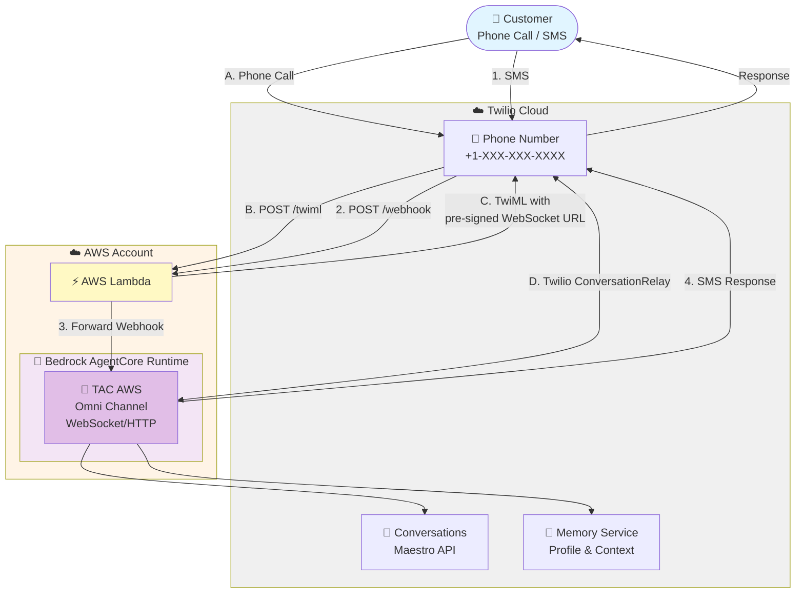

# TAC AgentCore - AWS Lambda Deployment

Deploy AWS Lambda webhook proxy for Twilio Agent Connect with AgentCore.

## Overview

**Components:**
- **Lambda Function** - Lightweight webhook router (`/twiml`, `/webhook`)
- **Function URL** - Public HTTPS endpoint (no API Gateway needed)
- **IAM Role** - AgentCore invoke permissions

**Security:**
- All requests validated using Twilio webhook signature (`X-Twilio-Signature` header)
- Requests with invalid signatures are rejected with 403 status

**How it works:**
- Voice: Lambda generates TwiML → Twilio ConversationRelay connects to AgentCore via WebSocket
- SMS: Lambda forwards webhooks → AgentCore processes and responds via Conversations API

## Architecture



## Prerequisites

- **AgentCore runtime deployed** - Get the `AGENTCORE_RUNTIME_ARN` from agent deployment
- **AWS credentials configured** - `aws configure` or AWS_PROFILE set
- **Docker running** - CDK uses Docker to build Python dependencies
- **Node.js 20+** - For CDK
- **CDK bootstrapped** - See [parent README](../README.md#bootstrap-cdk-one-time-setup)

## Environment Variables

Create a `.env` file in this directory:

```bash
cp .env.example .env
# Edit .env with your values
```

**Required variables:**

```bash
# AgentCore Runtime ARN (from agent deployment output)
AGENTCORE_RUNTIME_ARN=arn:aws:bedrock-agentcore:us-east-1:123456789012:runtime/tacagent-xxxxx

# Twilio Configuration
TWILIO_CONVERSATION_CONFIGURATION_ID=WRxxxx
TWILIO_AUTH_TOKEN=your_auth_token_here

# AWS Configuration
AWS_REGION=us-east-1
AWS_ACCOUNT_ID=123456789012
```

## Deployment

### 1. Install CDK Dependencies

```bash
cd cdk
npm install
```

### 2. Deploy Lambda

```bash
AWS_PROFILE=your-profile npx cdk deploy
```

**Expected output:**

```
Outputs:
TacAgentcoreLambdaStack.VoiceWebhookUrl = https://xxxxx.lambda-url.us-east-1.on.aws/twiml
TacAgentcoreLambdaStack.ConversationWebhookUrl = https://xxxxx.lambda-url.us-east-1.on.aws/webhook
TacAgentcoreLambdaStack.FunctionArn = arn:aws:lambda:us-east-1:123456789012:function:TacAgentcoreLambdaStack-...
```

## Twilio Configuration

### 1. Configure Voice Webhook (Phone Number)

Configure voice calls to use the Lambda webhook:

1. Go to Twilio Console → Phone Numbers → Active Numbers
2. Select your phone number
3. Under "Voice Configuration":
   - **A CALL COMES IN:** Webhook
   - **URL:** Use the `VoiceWebhookUrl` from CDK outputs
   - **HTTP Method:** POST
4. Save

### 2. Configure Conversation Webhook (Conversation Orchestrator)

Configure SMS/messaging to use the Lambda webhook:

1. Go to Twilio Console → Conversation Orchestrator
2. Select your Conversation Configuration
3. Under "Webhook Configuration":
   - **Webhook URL:** Use the `ConversationWebhookUrl` from CDK outputs
   - **HTTP Method:** POST
4. Save

## Project Structure

```
aws_lambda/
├── .env                # Configuration (create from .env.example)
├── .env.example        # Template
├── cdk/                # CDK infrastructure (TypeScript)
│   ├── bin/
│   │   ├── cdk.ts              # CDK entry point
│   │   └── env-config.ts       # Environment loader
│   ├── lib/
│   │   └── cdk-stack.ts        # Lambda stack definition
│   ├── package.json
│   └── cdk.json
├── app/                # Lambda application code (Python)
│   ├── index.py                # Handler (routes /twiml and /webhook)
│   └── requirements.txt        # Python dependencies
└── README.md           # This file
```

