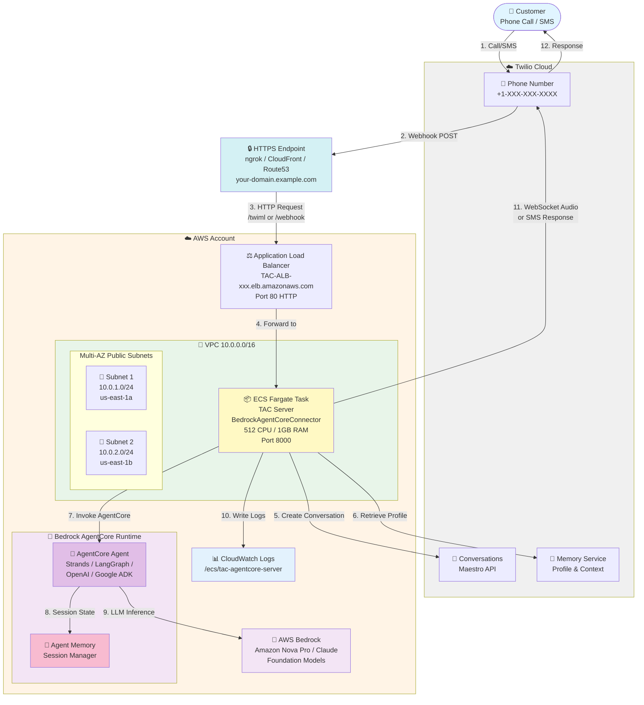

# TAC AgentCore Server - AWS Fargate Deployment

Complete guide for deploying Twilio Agent Connect (TAC) with AWS Bedrock AgentCore on AWS Fargate.

## Table of Contents

- [Overview](#overview)
- [Architecture](#architecture)
- [AWS Services](#aws-services)
- [Deployment](#deployment)

---

## Overview

This deployment runs a voice and SMS AI agent using:
- **Twilio** - Voice/SMS communication platform
- **AWS Bedrock AgentCore** - Managed agent runtime with built-in memory and observability
- **AWS Bedrock** - LLM inference (Amazon Nova Pro, Claude, etc.)
- **TAC (Twilio Agent Connect)** - Integration middleware

The system handles incoming calls and SMS messages, routes them through an AI agent deployed on AgentCore Runtime, and manages conversation state using Twilio's Maestro (Conversations API) and Memory services.

---

## Architecture



---

## AWS Services

### Core Services

| Service | Purpose |
|---------|---------|
| **Bedrock AgentCore Runtime** | Managed agent hosting with built-in memory and observability |
| **ECS Fargate** | Container runtime for TAC server |
| **Application Load Balancer** | Stable DNS endpoint, health checks, WebSocket support |
| **AWS Bedrock** | LLM inference - Amazon Nova Pro, Claude, etc. (pay-per-token) |
| **VPC** | Network isolation (10.0.0.0/16) |
| **Internet Gateway** | Internet connectivity |
| **Security Groups** | Firewall rules |
| **CloudWatch Logs** | Application logs (7-day retention) |
| **IAM Roles** | AWS permissions management (Bedrock, AgentCore access) |

### Optional Services (HTTPS Layer)

| Service | Purpose |
|---------|---------|
| **ngrok** | HTTPS tunnel for testing/development |
| **CloudFront** | HTTPS endpoint with free AWS domain |
| **Route53 + ACM** | Custom domain with AWS certificate |

---

## Deployment

### Prerequisites

**Part 1 - Agent Deployment:**
- AWS CLI configured with appropriate credentials
- Python 3.10+ (Python 3.13 recommended)
- pip or uv package manager
- AWS account with:
  - Bedrock model access (Amazon Nova Pro)
  - IAM permissions for AgentCore, S3, CloudWatch
  - Region: us-east-1 (or your preferred region)

**Part 2 - TAC Server Deployment:**
- Docker installed
- AWS ECR repository (to store your Docker image)
- HTTPS endpoint (choose one):
  - **ngrok** - For testing and development
  - **CloudFront** - For production with AWS-provided HTTPS domain
  - **Route53 + ACM** - For production with custom domain
- Twilio account with:
  - Account SID
  - Auth Token
  - API Key and Secret
  - Phone number
  - Conversation Configuration ID from Conversation Orchestrator

**Where to find Twilio credentials:**
- Account SID: Twilio Console → Account Dashboard (top section)
- Auth Token & API Keys: Twilio Console → Account → API Keys & Tokens
- Conversation Configuration ID: Twilio Console → Conversation Orchestrator → Configuration

### Part 1: Deploy Agent to AgentCore

The `agent/` folder contains a simple Strands agent ready for deployment.

**Step 1: Install AgentCore CLI**

```bash
cd agentcore_aws_fargate/agent

pip install bedrock-agentcore-starter-toolkit
```

**Step 2: Configure Agent for Deployment**

```bash
agentcore configure --entrypoint agent.py --name simpleagent --non-interactive
```

**Step 3: Deploy to AWS AgentCore**

```bash
agentcore launch
```

**Expected output:**
```
✅ Deployment completed successfully
   Agent ARN: arn:aws:bedrock-agentcore:us-east-1:ACCOUNT:runtime/simpleagent-XXX
```

**Step 4: Test Deployed Agent**

```bash
agentcore invoke '{"prompt": "Hello"}'
```

**Expected response:**
```
Response:
Hello! It's nice to have you here. I'm here to help with whatever you might
need. Whether you have a question, need assistance with a topic, or just want to
chat, feel free to let me know how I can assist you. What's on your mind today?
```

**Step 5: Get Agent ARN**

Save the **Agent ARN** from the deployment output - you'll need it for the TAC server configuration in Part 2.

Example: `arn:aws:bedrock-agentcore:us-east-1:123456789012:runtime/simpleagent-XXX`

### Part 2: Deploy TAC Server on Fargate

### Step 0: Build and Publish Docker Image

**1. Build wheels:**

```bash
cd agentcore_aws_fargate
./build-wheels.sh
```

**2. Build Docker image:**

```bash
docker build -t tac-agentcore-server:latest -f Dockerfile .
```

**3. Publish to AWS ECR:**

Publish your Docker image to AWS ECR. You'll need the ECR image URI for Step 1.

Example URI format: `123456789012.dkr.ecr.us-east-1.amazonaws.com/tac-agentcore-server:latest`

### Step 1: Deploy CloudFormation Stack

Deploy the infrastructure first:

```bash
cd agentcore_aws_fargate

aws cloudformation deploy \
  --template-file cloudformation.yaml \
  --stack-name TACAgentCoreStack \
  --parameter-overrides \
    ImageURI=YOUR_ECR_URI:latest \
    TwilioAccountSid=YOUR_ACCOUNT_SID \
    TwilioAuthToken=YOUR_AUTH_TOKEN \
    TwilioApiKey=YOUR_API_KEY \
    TwilioApiSecret=YOUR_API_SECRET \
    TwilioPhoneNumber=YOUR_PHONE_NUMBER \
    TwilioConversationConfigurationId=YOUR_CONVERSATION_CONFIGURATION_ID \
    TwilioVoicePublicDomain=YOUR_HTTPS_DOMAIN \
    BedrockAgentCoreAgentArn=YOUR_AGENT_ARN \
  --capabilities CAPABILITY_IAM \
  --region us-east-1
```

### Step 2: Get ALB DNS Name

```bash
aws cloudformation describe-stacks \
  --stack-name TACAgentCoreStack \
  --query 'Stacks[0].Outputs[?OutputKey==`LoadBalancerDNS`].OutputValue' \
  --output text \
  --region us-east-1
```

**Output example:** `TAC-ALB-xxx.us-east-1.elb.amazonaws.com`

### Step 3: Connect HTTPS Endpoint to ALB

Point your HTTPS endpoint to the ALB DNS from Step 3.

For example, if using ngrok:
```bash
ngrok http TAC-ALB-xxx.us-east-1.elb.amazonaws.com:80 --domain=your-domain.ngrok.app
```

### Step 4: Configure Twilio Webhooks

**Voice (Phone Numbers):**
1. Go to Twilio Console → Phone Numbers → Active Numbers
2. Select your phone number
3. Set **Voice URL:** `https://your-https-domain.com/twiml` (POST)

**SMS (Conversation Orchestrator):**
1. Go to Twilio Console → Conversation Orchestrator
2. Select your Conversation Service
3. Configure webhook
4. Set **Webhook URL:** `https://your-https-domain.com/webhook` (POST)

### Step 5: Test Your Deployment

Make a phone call or send an SMS message to your Twilio phone number to test the deployment.

