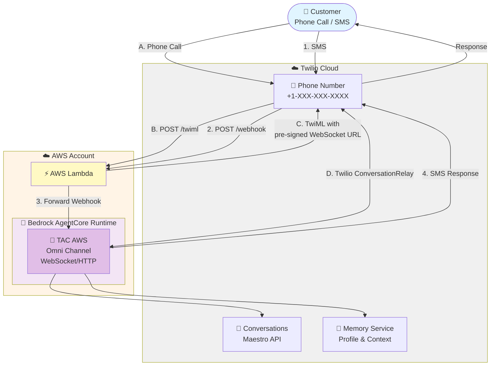

# TAC AgentCore Deployment with AWS Lambda

Deploy Twilio Agent Connect with AWS Bedrock AgentCore using AWS Lambda for webhook handling.

## Architecture



## Deployment Components

- **AgentCore Runtime (agent/)** - Strands agent with TAC integration, HTTP and WebSocket endpoints
- **AWS Lambda Webhook Proxy (aws_lambda/)** - Serverless webhook router, no API Gateway needed

## Prerequisites

- **AWS Account** with:
  - Bedrock model access (Amazon Nova Pro or Claude)
  - IAM permissions for AgentCore, Lambda, and CloudFormation
  - Region: us-east-1 (or your preferred region)
- **AWS CLI** installed and configured with a named profile:
  ```bash
  # Configure a new profile
  aws configure --profile your-profile-name
  
  # Set as default for this session
  export AWS_PROFILE=your-profile-name
  ```
  See [AWS CLI Configuration](https://docs.aws.amazon.com/cli/latest/userguide/cli-configure-profiles.html) for details.
- **Node.js 20+** - For AgentCore CLI and CDK
- **Python 3.10+** and **uv** - For agent code ([install uv](https://docs.astral.sh/uv/getting-started/installation/))
- **Docker** running (for Lambda deployment)

### Bootstrap CDK (One-Time Setup)

All deployments use AWS CDK. Bootstrap your AWS account once:

```bash
AWS_PROFILE=your-profile npx cdk bootstrap aws://YOUR_ACCOUNT_ID/REGION
```

**Note:** Only needs to be done once per account/region.

---

## Configuration Setup

Before deploying either component, configure your environment variables once:

```bash
cp .env.example .env
```

Edit `.env` in the `agentcore_aws_lambda/` folder with your values:

```bash
# AWS Configuration
AWS_ACCOUNT_ID=123456789012
AWS_REGION=us-east-1
# AWS_PROFILE=default  # Optional: if using non-default profile

# Twilio Account Credentials
TWILIO_ACCOUNT_SID=ACxxxxxxxxxxxxxxxxxxxxxxxxxxxxxxxx
TWILIO_AUTH_TOKEN=your_auth_token

# Twilio API Credentials (for TAC ConversationClient)
TWILIO_API_KEY=SKxxxxxxxxxxxxxxxxxxxxxxxxxxxxxxxx
TWILIO_API_SECRET=your_api_secret

# Twilio Phone Number
TWILIO_PHONE_NUMBER=+1234567890

# Twilio Conversation Configuration ID
TWILIO_CONVERSATION_CONFIGURATION_ID=WRxxxx

# AgentCore Runtime ARN (will be populated after agent deployment)
# AGENTCORE_RUNTIME_ARN=arn:aws:bedrock-agentcore:us-east-1:123456789012:runtime/tacagent-xxxxx

# Optional: Twilio Log Level (DEBUG, INFO, WARNING, ERROR)
# TWILIO_LOG_LEVEL=INFO
```

**Where to find Twilio credentials:**
- Account SID & Auth Token: Twilio Console → Account → API Keys & Tokens
- API Key & Secret: Create API Key
- Conversation Configuration ID: Twilio Console → Conversation Orchestrator

**Note:** The centralized `.env` file is used by both AgentCore runtime and AWS Lambda deployments. You only need to configure it once.

---

## Part 1: Deploy AgentCore Runtime

### 1. Install AgentCore CLI

```bash
npm install -g @aws/agentcore@0.17
```

### 2. Install CDK Dependencies

The AgentCore CLI needs TypeScript and CDK dependencies:

```bash
cd agent/agentcore/cdk
npm install
cd ../../..
```

### 3. Configure Deployment Targets

The AgentCore CLI requires an `aws-targets.json` file to know where to deploy:

```bash
cp agent/agentcore/aws-targets.json.example agent/agentcore/aws-targets.json
```

This creates an empty array `[]` that the AgentCore CLI will populate during deployment with your AWS account details. The file is gitignored because it contains sensitive AWS account information.

### 4. Deploy AgentCore Runtime

Run from the agent folder:

```bash
cd agent
AWS_PROFILE=your-profile agentcore deploy
```

After deployment completes, retrieve the Runtime ARN:

```bash
AWS_PROFILE=your-profile agentcore status
```

This will display the deployed runtime information including the Runtime ARN.

**Important:** Copy the Runtime ARN and add it to the `.env` file (in the parent `agentcore_aws_lambda/` folder) as `AGENTCORE_RUNTIME_ARN`. This is required for the AWS Lambda webhook proxy deployment in Part 2.

```bash
cd ..  # Return to agentcore_aws_lambda/ folder
# Edit .env and add:
# AGENTCORE_RUNTIME_ARN=arn:aws:bedrock-agentcore:us-east-1:123456789012:runtime/tacagent-xxxxx
```

---

## Part 2: Deploy AWS Lambda Webhook Proxy

### 1. Install CDK Dependencies

```bash
cd aws_lambda/cdk
npm install
```

### 2. Deploy Lambda

```bash
AWS_PROFILE=your-profile npx cdk deploy
```

**Note:** The Lambda deployment reads from the same centralized `.env` file. Make sure you added the `AGENTCORE_RUNTIME_ARN` from Part 1, Step 4.

**Expected output:**

```
Outputs:
TacAgentcoreLambdaStack.VoiceWebhookUrl = https://xxxxx.lambda-url.us-east-1.on.aws/twiml
TacAgentcoreLambdaStack.ConversationWebhookUrl = https://xxxxx.lambda-url.us-east-1.on.aws/webhook
TacAgentcoreLambdaStack.FunctionArn = arn:aws:lambda:us-east-1:123456789012:function:TacAgentcoreLambdaStack-...
```

---

## Twilio Configuration

### 1. Configure Voice Webhook (Phone Number)

Configure voice calls to use the Lambda webhook:

1. Go to Twilio Console → Phone Numbers → Active Numbers
2. Select your phone number
3. Under "Voice Configuration":
   - **A CALL COMES IN:** Webhook
   - **URL:** Use the `VoiceWebhookUrl` from CDK outputs
   - **HTTP Method:** POST
4. Save

### 2. Configure Conversation Webhook (Conversation Orchestrator)

Configure SMS/messaging to use the Lambda webhook:

1. Go to Twilio Console → Conversation Orchestrator
2. Select your Conversation Configuration
3. Under "Webhook Configuration":
   - **Webhook URL:** Use the `ConversationWebhookUrl` from CDK outputs
   - **HTTP Method:** POST
4. Save

---
