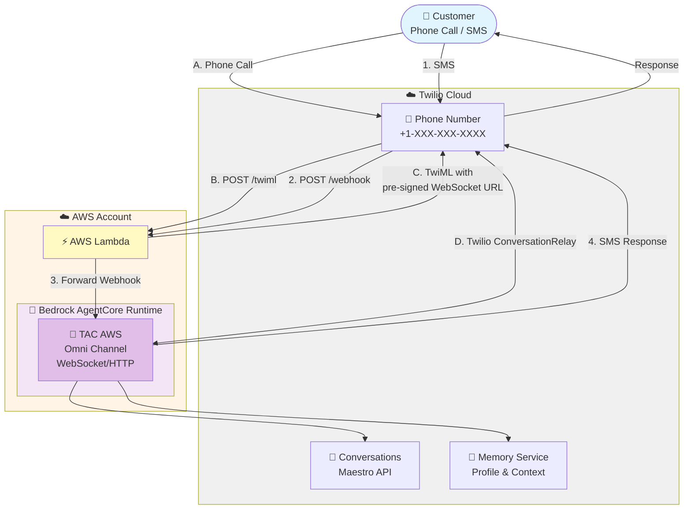

# TAC AgentCore - AWS Lambda Deployment

Deploy Twilio Agent Connect with AWS Bedrock AgentCore using serverless Lambda.

## Overview

**Components:**
- **Lambda**: Lightweight webhook router (`/twiml`, `/webhook`)
- **AgentCore**: Full TAC server with agent logic
- **Twilio**: Voice/SMS channels with Conversations and Memory

**How it works:**
- Voice: Lambda generates TwiML → Twilio ConversationRelay connects to AgentCore via WebSocket
- SMS: Lambda forwards webhooks → AgentCore processes and responds via Conversations API

---

## Architecture

### High-Level Architecture



---

## AWS Services

### Core Services

| Service | Purpose |
|---------|---------|
| **Bedrock AgentCore Runtime** | Managed agent hosting with built-in memory and observability |
| **AWS Lambda** | Serverless webhook handler for Twilio requests |
| **Lambda Function URL** | Public HTTPS endpoint for webhooks (no ALB/API Gateway needed) |
| **AWS Bedrock** | LLM inference - Amazon Nova Pro, Claude, etc. (pay-per-token) |
| **S3** | Agent deployment packages and Lambda code storage |
| **IAM Roles** | Lambda execution role with Bedrock and AgentCore permissions |
| **CloudWatch Logs** | Application and agent runtime logs |


---

## Deployment

### Prerequisites

**AWS Account:**
- AWS CLI configured with appropriate credentials
- AWS account with:
  - Bedrock model access (Amazon Nova Pro or Claude)
  - IAM permissions for AgentCore, Lambda, S3, CloudFormation
  - Region: us-east-1 (or your preferred region)

**Twilio Account:**
- Account SID
- Auth Token
- API Key and Secret
- Phone number
- Conversation Configuration ID from Conversation Orchestrator

**Where to find Twilio credentials:**
- Account SID & Auth Token: Twilio Console → Account → API Keys & Tokens
- API Key & Secret: Twilio Console → Account → API Keys & Tokens → Create API Key
- Conversation Configuration ID: Twilio Console → Conversation Orchestrator → Configuration

---

### Step 1: Configure Environment

Copy the example environment file and update with your credentials:

```bash
# From the agentcore_lambda directory
cp .env.example .env
```

Edit `.env` with your values:

```bash
# AWS CLI Configuration - Required for all deployments
AWS_REGION=us-east-1
AWS_PROFILE=your-aws-profile-name

# Infrastructure [INFRA]
S3_BUCKET=tac-deployment-bucket

# Twilio Configuration - Required for agentcore and lambda
TWILIO_CONVERSATION_CONFIGURATION_ID=conv_configuration_xxxxx

# AgentCore Configuration [AGENTCORE]
TWILIO_ACCOUNT_SID=ACxxxxxxxxxxxxxxxxxxxxxxxxxxxxxxxx
TWILIO_AUTH_TOKEN=your_auth_token
TWILIO_API_KEY=SKxxxxxxxxxxxxxxxxxxxxxxxxxxxxxxxx
TWILIO_API_SECRET=your_api_secret
TWILIO_PHONE_NUMBER=+1234567890
TWILIO_LOG_LEVEL=DEBUG

# Lambda Configuration [LAMBDA] - Will be populated after agent deployment
AGENTCORE_RUNTIME_ID=
```

**Note:** You'll need to update `AGENTCORE_RUNTIME_ID` after deploying AgentCore in Step 3.

---

### Step 2: Deploy Infrastructure

Deploy the S3 bucket for deployment packages:

```bash
cd infra
./deploy.sh
```

**Note:** If the bucket name is globally taken, update `S3_BUCKET` in `.env` with a unique name and retry.

---

### Step 3: Deploy AgentCore

The `agentcore/` folder contains the agent code ready for deployment.

**Install AgentCore CLI:**

```bash
pip install bedrock-agentcore-starter-toolkit
```

**Deploy the agent:**

```bash
cd agentcore
./deploy.sh
```

**Expected output:**

```
✅ AgentCore deployment complete!
Agent ARN: arn:aws:bedrock-agentcore:us-east-1:ACCOUNT:runtime/tacagent-XXXXX
```

**Save the Agent Runtime ID:**

The runtime ID is the last part of the ARN (e.g., `tacagent-XXXXX`). Update your `.env` file:

```bash
AGENTCORE_RUNTIME_ID=tacagent-XXXXX
```

---

### Step 5: Deploy Lambda Function

The `lambda/` folder contains the Lambda webhook handler.

**Deploy CloudFormation stack:**

```bash
cd lambda
./deploy.sh
```

**Expected output:**

```
✅ Lambda deployment complete!

Stack Outputs:
+------------------+------------------------------------------------------------------+
| FunctionArn      | arn:aws:lambda:us-east-1:ACCOUNT:function:tac-proxy              |
| LambdaFunctionUrl| https://xxxxx.lambda-url.us-east-1.on.aws/                       |
| VoiceWebhookUrl  | https://xxxxx.lambda-url.us-east-1.on.aws/twiml                  |
| SmsWebhookUrl    | https://xxxxx.lambda-url.us-east-1.on.aws/webhook                |
+------------------+------------------------------------------------------------------+
```

**Save the webhook URLs** - you'll need them for Twilio configuration.

---

### Step 6: Configure Twilio Webhooks

**Voice Webhook (Phone Numbers):**

1. Go to [Twilio Console → Phone Numbers → Active Numbers](https://console.twilio.com/us1/develop/phone-numbers/manage/incoming)
2. Select your phone number
3. Under "Voice Configuration":
   - **A CALL COMES IN:** Webhook
   - **URL:** `https://xxxxx.lambda-url.us-east-1.on.aws/twiml`
   - **HTTP Method:** POST
4. Save

**SMS Webhook (Conversation Orchestrator):**

1. Go to [Twilio Console → Conversation Orchestrator](https://console.twilio.com/us1/develop/conversations/orchestrator)
2. Select your Conversation Service
3. Configure webhook:
   - **Webhook URL:** `https://xxxxx.lambda-url.us-east-1.on.aws/webhook`
   - **HTTP Method:** POST
4. Save

