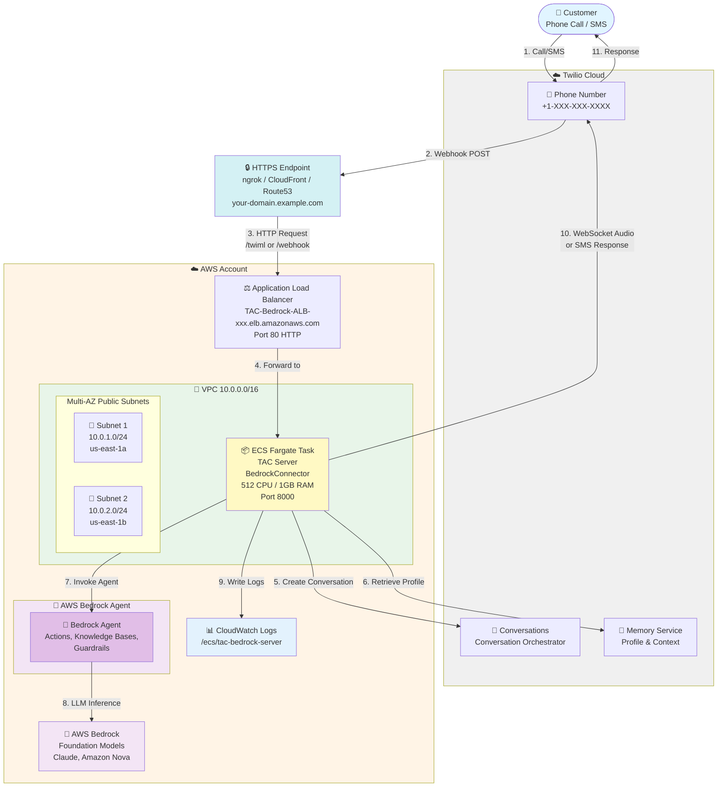

# TAC Bedrock Agent Server - AWS Fargate Deployment

Complete guide for deploying Twilio Agent Connect (TAC) with AWS Bedrock Agent on AWS Fargate.

## Table of Contents

- [Overview](#overview)
- [Architecture](#architecture)
- [AWS Services](#aws-services)
- [Deployment](#deployment)

---

## Overview

This deployment runs a voice and SMS AI agent using:
- **Twilio** - Voice/SMS communication platform
- **AWS Bedrock Agent** - Fully managed agent with actions, knowledge bases, and guardrails
- **TAC (Twilio Agent Connect)** - Integration middleware

The system handles incoming calls and SMS messages, routes them through an AI agent deployed on AWS Bedrock Agent, and manages conversation state using Twilio's Conversation Orchestrator and Memory services.

---

## Architecture

### High-Level Architecture



---

## AWS Services

### Core Services

| Service | Purpose |
|---------|---------|
| **AWS Bedrock Agent** | Fully managed agent with actions, knowledge bases, and guardrails |
| **ECS Fargate** | Container runtime for TAC server |
| **Application Load Balancer** | Stable DNS endpoint, health checks, WebSocket support |
| **AWS Bedrock** | LLM inference - Claude, Amazon Nova, etc. (pay-per-token) |
| **VPC** | Network isolation (10.0.0.0/16) |
| **Internet Gateway** | Internet connectivity |
| **Security Groups** | Firewall rules |
| **CloudWatch Logs** | Application logs (7-day retention) |
| **IAM Roles** | AWS permissions management (Bedrock access) |

### Optional Services (HTTPS Layer)

| Service | Purpose |
|---------|---------|
| **ngrok** | HTTPS tunnel for testing/development |
| **CloudFront** | HTTPS endpoint with free AWS domain |
| **Route53 + ACM** | Custom domain with AWS certificate |

---

## Deployment

### Prerequisites

- AWS CLI configured with appropriate credentials
- Python 3.10+ (Python 3.13 recommended)
- Docker installed
- AWS account with:
  - Bedrock Agent already deployed
  - IAM permissions for ECS, VPC, ALB
  - Region: us-east-1 (or your preferred region)
- HTTPS endpoint (choose one):
  - **ngrok** - For testing and development
  - **CloudFront** - For production with AWS-provided HTTPS domain
  - **Route53 + ACM** - For production with custom domain
- Twilio account with:
  - Account SID
  - Auth Token
  - API Key and Secret
  - Phone number
  - Conversation Configuration ID from Conversation Orchestrator

**Where to find Twilio credentials:**
- Account SID & Auth Token: Twilio Console → Account → API Keys & Tokens
- API Key & Secret: Twilio Console → Account → API Keys & Tokens
- Conversation Configuration ID: Twilio Console → Conversation Orchestrator → Configuration

**Where to find Bedrock Agent credentials:**
- Bedrock Agent ID: AWS Console → Bedrock → Agents → Select your agent
- Bedrock Agent Alias ID: AWS Console → Bedrock → Agents → Select your agent → Aliases (default: TSTALIASID)

### Step 0: Build and Publish Docker Image

**1. Build Docker image:**

```bash
# From the bedrock_aws_fargate directory
docker build -t tac-bedrock-server:latest .
```

**2. Publish to AWS ECR:**

Publish your Docker image to AWS ECR. You'll need the ECR image URI for Step 1.

Example URI format: `123456789012.dkr.ecr.us-east-1.amazonaws.com/tac-bedrock-server:latest`

### Step 1: Deploy CloudFormation Stack

Deploy the infrastructure (from the bedrock_aws_fargate directory):

```bash
aws cloudformation deploy \
  --template-file cloudformation.yaml \
  --stack-name TACBedrockStack \
  --parameter-overrides \
    ImageURI=YOUR_ECR_URI:latest \
    TwilioAccountSid=YOUR_ACCOUNT_SID \
    TwilioAuthToken=YOUR_AUTH_TOKEN \
    TwilioApiKey=YOUR_API_KEY \
    TwilioApiSecret=YOUR_API_SECRET \
    TwilioPhoneNumber=YOUR_PHONE_NUMBER \
    TwilioConversationConfigurationId=YOUR_CONVERSATION_CONFIGURATION_ID \
    TwilioVoicePublicDomain=YOUR_HTTPS_DOMAIN \
    BedrockAgentId=YOUR_BEDROCK_AGENT_ID \
    BedrockAgentAliasId=TSTALIASID \
  --capabilities CAPABILITY_IAM \
  --region us-east-1
```

### Step 2: Get ALB DNS Name

```bash
aws cloudformation describe-stacks \
  --stack-name TACBedrockStack \
  --query 'Stacks[0].Outputs[?OutputKey==`LoadBalancerDNS`].OutputValue' \
  --output text \
  --region us-east-1
```

**Output example:** `TAC-Bedrock-ALB-xxx.us-east-1.elb.amazonaws.com`

### Step 3: Connect HTTPS Endpoint to ALB

Point your HTTPS endpoint to the ALB DNS from Step 2.

For example, if using ngrok:
```bash
ngrok http TAC-Bedrock-ALB-xxx.us-east-1.elb.amazonaws.com:80 --domain=your-domain.ngrok.app
```

### Step 4: Configure Twilio Webhooks

**Voice (Phone Numbers):**
1. Go to Twilio Console → Phone Numbers → Active Numbers
2. Select your phone number
3. Set **Voice URL:** `https://your-https-domain.com/twiml` (POST)

**SMS (Conversation Orchestrator):**
1. Go to Twilio Console → Conversation Orchestrator
2. Select your Conversation Service
3. Configure webhook
4. Set **Webhook URL:** `https://your-https-domain.com/webhook` (POST)

### Step 5: Test Your Deployment

Make a phone call or send an SMS message to your Twilio phone number to test the deployment.
