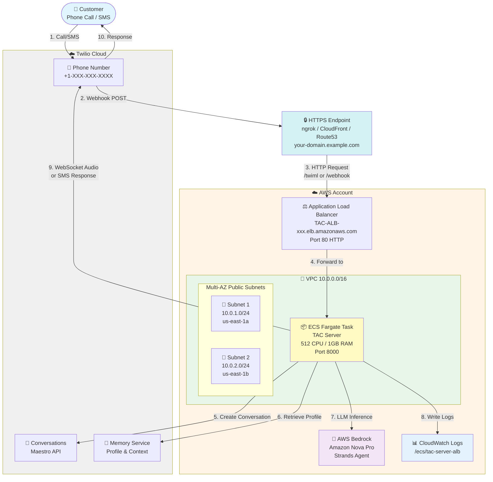

# TAC Strands Server - AWS Fargate Deployment

Complete guide for deploying Twilio Agent Connect (TAC) with Strands agent framework on AWS Fargate.

## Table of Contents

- [Overview](#overview)
- [Architecture](#architecture)
- [AWS Services](#aws-services)
- [Deployment](#deployment)

---

## Overview

This deployment runs a voice and SMS AI agent using:
- **Twilio** - Voice/SMS communication platform
- **AWS Bedrock** - LLM inference (Amazon Nova Pro)
- **Strands** - Agent orchestration framework
- **TAC (Twilio Agent Connect)** - Integration middleware

The system handles incoming calls and SMS messages, routes them through an AI agent powered by AWS Bedrock, and manages conversation state using Twilio's Maestro (Conversations API) and Memory services.

---

## Architecture

### High-Level Architecture



---

## AWS Services

### Core Services

| Service | Purpose |
|---------|---------|
| **ECS Fargate** | Container runtime for TAC server |
| **Application Load Balancer** | Stable DNS endpoint, health checks, WebSocket support |
| **AWS Bedrock** | LLM inference - Amazon Nova Pro (pay-per-token) |
| **VPC** | Network isolation (10.0.0.0/16) |
| **Internet Gateway** | Internet connectivity |
| **Security Groups** | Firewall rules |
| **CloudWatch Logs** | Application logs (7-day retention) |
| **IAM Roles** | AWS permissions management (Bedrock access) |

### Optional Services (HTTPS Layer)

| Service | Purpose |
|---------|---------|
| **ngrok** | HTTPS tunnel for testing/development |
| **CloudFront** | HTTPS endpoint with free AWS domain |
| **Route53 + ACM** | Custom domain with AWS certificate |

---

## Deployment

### Prerequisites

**Required:**
- AWS CLI configured with appropriate credentials
- Docker installed
- Python 3.10+ with `uv` package manager
- AWS ECR repository (to store your Docker image)
- HTTPS endpoint (choose one):
  - **ngrok** - For testing and development
  - **CloudFront** - For production with AWS-provided HTTPS domain
  - **Route53 + ACM** - For production with custom domain
- Twilio account with:
  - Auth Token
  - API Key and Secret
  - Phone number
  - Conversation Service SID from Conversation Orchestrator

**Where to find Twilio credentials:**
- Auth Token & API Keys: Twilio Console → Account → API Keys & Tokens
- Conversation Service SID: Twilio Console → Conversation Orchestrator → Configuration

### Step 0: Build and Publish Docker Image

**1. Build wheels:**

```bash
cd strands_aws_fargate
./build-wheels.sh
```

**2. Build Docker image:**

```bash
docker build -t tac-strands-server:latest -f Dockerfile .
```

**3. Publish to AWS ECR:**

Publish your Docker image to AWS ECR. You'll need the ECR image URI for Step 1.

Example URI format: `123456789012.dkr.ecr.us-east-1.amazonaws.com/tac-strands-server:latest`

### Step 1: Deploy CloudFormation Stack

Deploy the infrastructure first:

```bash
cd strands_aws_fargate

aws cloudformation deploy \
  --template-file cloudformation.yaml \
  --stack-name TACStack \
  --parameter-overrides \
    ImageURI=YOUR_ECR_URI:latest \
    TwilioTacAuthToken=YOUR_AUTH_TOKEN \
    TwilioTacApiKey=YOUR_API_KEY \
    TwilioTacApiToken=YOUR_API_TOKEN \
    TwilioTacPhoneNumber=YOUR_PHONE_NUMBER \
    TwilioTacConversationServiceSid=YOUR_CONVERSATION_SERVICE_SID \
    TwilioTacVoicePublicDomain=YOUR_HTTPS_DOMAIN \
  --capabilities CAPABILITY_IAM \
  --region us-east-1
```

### Step 2: Get ALB DNS Name

```bash
aws cloudformation describe-stacks \
  --stack-name TACStack \
  --query 'Stacks[0].Outputs[?OutputKey==`LoadBalancerDNS`].OutputValue' \
  --output text \
  --region us-east-1
```

**Output example:** `TAC-ALB-xxx.us-east-1.elb.amazonaws.com`

### Step 3: Connect HTTPS Endpoint to ALB

Point your HTTPS endpoint to the ALB DNS from Step 2.

For example, if using ngrok:
```bash
ngrok http TAC-ALB-xxx.us-east-1.elb.amazonaws.com:80 --domain=your-domain.ngrok.app
```

### Step 4: Configure Twilio Webhooks

**Voice (Phone Numbers):**
1. Go to Twilio Console → Phone Numbers → Active Numbers
2. Select your phone number
3. Set **Voice URL:** `https://your-https-domain.com/twiml` (POST)

**SMS (Conversation Orchestrator):**
1. Go to Twilio Console → Conversation Orchestrator
2. Select your Conversation Service
3. Configure webhook
4. Set **Webhook URL:** `https://your-https-domain.com/webhook` (POST)

### Step 5: Test Your Deployment

Make a phone call or send an SMS message to your Twilio phone number to test the deployment.

