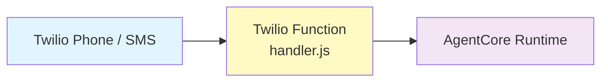

# Twilio Function — AgentCore Proxy

A [Twilio Function](https://www.twilio.com/docs/serverless/functions-assets/functions)
alternative to the AWS Lambda webhook proxy (`deploy/agentcore_aws_lambda`). It
routes Twilio webhooks to an AWS Bedrock AgentCore runtime — entirely from
Twilio's serverless runtime, with no Lambda or API Gateway to manage.

## Architecture



- **`/handler?route=twiml`** (Voice) — generates a pre-signed AgentCore
  WebSocket URL and returns TwiML with `<ConversationRelay>`.
- **`/handler?route=webhook`** (SMS) — forwards the conversation webhook to the
  AgentCore HTTP endpoint via `InvokeAgentRuntimeCommand`.

> Because Twilio Functions run outside AWS, they authenticate with IAM **access
> keys** (not an IAM role). Create a scoped IAM user with permission to invoke
> the AgentCore runtime and generate pre-signed URLs.

## Structure

```
agentcore/
├── functions/
│   └── handler.js     # Main handler (routes twiml + webhook)
├── package.json       # Node.js dependencies
├── deploy.sh          # Deployment script
├── .env.example       # Environment template
└── README.md          # This file
```

## Prerequisites

- **AgentCore runtime deployed** — see `deploy/agentcore_aws_lambda` for the agent deployment.
- **AWS IAM user with access keys** — permission to invoke the AgentCore runtime.
- **Twilio CLI** — `npm install -g twilio-cli` and `twilio login`.

## Deployment

```bash
cp .env.example .env
# Edit .env with your values
./deploy.sh
```

The script validates env vars, installs dependencies, and deploys with
`twilio-run`, then prints the webhook URLs.

## Environment Variables

**Required:**
- `AWS_REGION` — AWS region
- `AWS_ACCESS_KEY_ID` / `AWS_SECRET_ACCESS_KEY` — IAM access keys
- `AGENTCORE_RUNTIME_ARN` — AgentCore runtime ARN
- `TWILIO_CONVERSATION_CONFIGURATION_ID` — Twilio conversation config ID
- `TWILIO_ACCOUNT_SID` / `TWILIO_AUTH_TOKEN` — Twilio credentials

**Optional:**
- `SERVICE_NAME` — Twilio service name (default: `tac-agentcore`)

## Twilio Configuration

After deployment, configure your Twilio phone number and Conversation
Orchestrator with the printed URLs:

- **Voice** — `A CALL COMES IN` → `https://<domain>/handler?route=twiml` (POST)
- **Conversation webhook** — `https://<domain>/handler?route=webhook` (POST)

## Local Development

```bash
npm install
npm run dev
# http://localhost:3000/handler?route=twiml
# http://localhost:3000/handler?route=webhook
```
