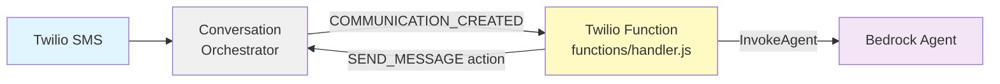

# Twilio Function — Bedrock Agent over SMS

A [Twilio Function](https://www.twilio.com/docs/serverless/functions-assets/functions)
that answers SMS with an **AWS Bedrock Agent**. It handles the Conversation
Orchestrator webhook directly and replies via the Conversations Actions API —
**no TAC library**, just the Bedrock SDK and Twilio's REST API.

## Flow



1. Conversation Orchestrator POSTs a `COMMUNICATION_CREATED` webhook.
2. The Function invokes the Bedrock Agent (`sessionId = conversationId` so the
   agent keeps per-conversation memory).
3. The Function POSTs a `SEND_MESSAGE` action to reply on the same conversation.

> SMS only. Non-message events are acked with 200 and ignored.

## Structure

```
bedrock/
├── functions/
│   └── handler.js     # webhook → Bedrock → reply, /handler?route=webhook
├── package.json       # @aws-sdk/client-bedrock-agent-runtime + twilio-run
├── deploy.sh          # validate env, install, deploy via twilio-run
├── .env.example
└── README.md
```

## Why no TAC library

The Function only needs two operations, both simple REST/SDK calls:

- **Read the webhook** — pull `conversationId`, `author.address`, and
  `content.text` out of the Conversation Orchestrator payload.
- **Send the reply** — `POST /v2/Conversations/{id}/Actions` with a
  `SEND_MESSAGE` action, using **address-based** participant refs
  (`from` = our number, `to` = the customer). This is the same request TAC
  makes, but because we address by phone number we skip TAC's participant
  lookup/reconciliation entirely.

The tradeoff: no automatic Conversation Memory injection or profile
reconciliation. The Bedrock Agent's own session (keyed by `conversationId`)
provides conversational continuity instead.

## Prerequisites

- **A Bedrock Agent** (with an alias — `TSTALIASID` is the default test alias).
- **AWS IAM user with access keys** — permission for `bedrock:InvokeAgent` on the agent.
- **Twilio CLI** — `npm install -g twilio-cli` and `twilio login`.

## Deployment

```bash
cp .env.example .env
# Edit .env with your values
./deploy.sh
```

Then set the printed URL as the **Conversation Orchestrator** webhook (POST):
`https://<domain>/handler?route=webhook`.

## Environment Variables

- `TWILIO_API_KEY`, `TWILIO_API_SECRET` — used for Basic auth on the Actions API
- `TWILIO_PHONE_NUMBER` — the agent's SMS address (the `from` on replies)
- `BEDROCK_AGENT_ID` (+ optional `BEDROCK_AGENT_ALIAS_ID`, default `TSTALIASID`)
- `AWS_REGION`, `AWS_ACCESS_KEY_ID`, `AWS_SECRET_ACCESS_KEY`
- Optional: `TWILIO_REGION`, `SERVICE_NAME` (default `tac-bedrock`)

## ⚠️ Bedrock Agent latency vs. the 10s Function limit

Twilio Functions must respond within **10 seconds**. A Bedrock Agent invocation
(especially cold, or with action groups / knowledge bases) can exceed that. If
you see timeouts, run the agent behind a proxy-to-a-runtime model (`agentcore/`,
or a Lambda with a longer timeout) instead.
