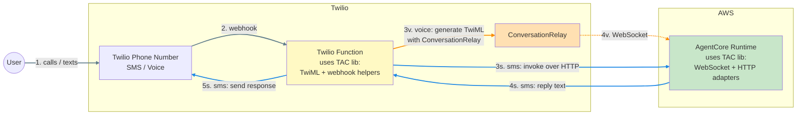
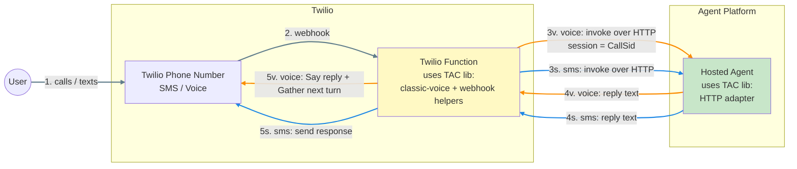

# Proposal: Hosted Agents on Twilio Functions (HA-TF)

**Status:** Proof of Concept
**Author:** jahuang
**Date:** 2026-07-03
**Origin:** Derived from Ryan's "hosted agent" idea — the notion that customers
should be able to bring their own already-hosted AI agent and connect it to
Twilio's channels, rather than rebuild or rehost the agent inside Twilio. This
proposal takes that idea and shows how Twilio Functions can be the connective
layer that makes it real, with no customer-managed infrastructure.

A pattern (and set of reusable helpers) for connecting **any hosted AI agent** to
**Twilio's multi-channel platform** (Voice + Messaging) using **Twilio Functions**
as the serverless glue — with **no customer-managed infrastructure**.

---

## 1. Context

Twilio Agent Connect (TAC) lets an AI agent participate in real conversations
across Voice, SMS, and WhatsApp. To do that, something has to sit between Twilio
and the agent runtime:

- **Voice** — when a call comes in, Twilio asks a webhook "what do I do?" and
  expects **TwiML** back. For a real-time conversation it can also open a
  **WebSocket** (`<ConversationRelay>`) that streams speech-to-text in and
  text-to-speech out.
- **Messaging** — the Conversation Orchestrator (OC) posts a JSON webhook on
  each inbound message; the integration invokes the agent and replies via the
  Conversations Actions API.

Today, standing this up usually means the customer deploys and operates their own
proxy — AWS Lambda + API Gateway, a Fargate service, etc. That is real
infrastructure to provision, secure, monitor, and pay for.

**Twilio Functions** are Twilio's own serverless runtime (request/response HTTP
handlers). They can host the webhook glue directly — no Lambda, no API Gateway,
no always-on server to manage. The open question this POC answers: *can a Twilio
Function alone connect a hosted agent across both channels, and for which agent
platforms?*

We validated **two working patterns**, both proven end-to-end against real agents
(AWS Bedrock AgentCore and AWS Bedrock Agents).

---

## 2. Why this idea

- **Radically less setup for the customer.** The proxy tier disappears. The
  customer points their Twilio number/OC at a Function URL and provides
  credentials for their agent platform. No Lambda, API Gateway, VPC, or
  container to own.
- **Bring-your-own-agent.** Customers already have agents on AWS, GCP, Azure,
  etc. The value is *connecting* those agents to Twilio, not forcing a rewrite.
- **Two patterns cover the whole spectrum of agent runtimes.** Some platforms
  expose a real-time WebSocket (low latency); many only expose a request/response
  HTTP endpoint. We support both, so no agent is left out.
- **Fits the TAC open-source library.** With a few helper functions shipped in
  the library, a customer's Function shrinks to a handful of lines. The library
  absorbs the Twilio-specific complexity (TwiML generation, OC webhook parsing,
  signature validation, Conversations Actions replies); the customer supplies
  only an "invoke my agent" function.

**Goal:** the customer writes ~10 lines of glue and gets a multi-channel AI agent.

---

## 3. How it works

### Pattern 1 — ConversationRelay (WebSocket-capable agents)

For agent platforms that host a WebSocket runtime (e.g. AWS Bedrock AgentCore).
Voice is real-time and low-latency; the Function only mints a pre-signed URL and
hands Twilio a `<ConversationRelay>` pointing at the agent's socket.

Both sides run the **TAC library** — the Twilio Function uses its Twilio-facing
helpers (TwiML/ConversationRelay generation, OC webhook handling), and the
AgentCore runtime uses its agent-side helpers (WebSocket/HTTP adapters, memory
context injection). Same library, different functions.



> Line colors: **grey** = shared entry (steps 1–2), **orange** = voice branch,
> **blue** = SMS branch.

- **Voice:** Function returns TwiML that connects Twilio's ConversationRelay
  (Twilio handles STT/TTS/media) to the agent's WebSocket. Real-time.
- **Messaging:** Function receives the OC webhook, invokes the agent over HTTP,
  and replies on the same conversation.

### Pattern 2 — Classic TwiML (HTTP-only agents)

For agent platforms that expose only a request/response HTTP endpoint (no
WebSocket). Voice is turn-based using `<Gather input="speech">` + `<Say>`.
Higher latency than ConversationRelay, but works for **any** HTTP agent and needs
**zero** extra infrastructure.

Both sides run the **TAC library** — the Twilio Function uses its Twilio-facing
helpers (classic-voice `<Gather>`/`<Say>` loop, OC webhook handling), and the
hosted agent uses its agent-side HTTP adapter. Same library, different functions.



> Line colors: **grey** = shared entry (steps 1–2), **orange** = voice branch,
> **blue** = SMS branch. The voice branch (3v–5v) repeats each turn — Twilio
> re-POSTs the caller's next `SpeechResult` at step 2 until the caller hangs up.

**Key design points validated in the POC**
- `sessionId = CallSid` gives the agent conversation continuity across turns
  (mirrors messaging using `conversationId`).
- The prompt is nested **inside** `<Gather>` so Twilio listens right after
  speaking — the fix that made multi-turn work reliably.
- On silence, a `<Redirect>` re-opens listening so the line stays open until the
  caller hangs up (no premature goodbye).

---

## 4. Implementation plan

The POC proved both patterns by hand-writing the Function handlers. The plan is
to fold the reusable parts into the TAC open-source library so customers write
almost nothing.

### Phase 1 — Twilio Function helpers (Twilio side)

Ship helpers that a customer's Function can call directly:

- **`handleClassicVoice(...)`** — the classic-TwiML turn loop (greet → gather
  speech → invoke → say → loop; silence-redirect; error fallback). *New — the
  only voice piece TAC doesn't already have.*
- **`handleConversationRelayVoice(...)`** — mint pre-signed WebSocket URL and
  emit `<ConversationRelay>` TwiML.
- **`handleMessagingWebhook(...)`** — parse the OC webhook, filter event types,
  invoke the agent, and reply via the Conversations Actions API. *Largely
  exists in TAC; wrap for Functions.*
- **Signature validation** helper for Twilio Function events.

### Phase 2 — Agent Gateway / adapter layer (agent side)

**TAC ships a library of adapters — one per hosted agent platform — and the
customer simply selects the one that matches their agent to connect it to
Twilio.** All adapters implement a common interface, so the Twilio Function
helpers from Phase 1 stay identical no matter which platform is chosen; swapping
platforms is a one-line change (pick a different adapter). Customers only write
their own adapter in the rare case their platform isn't covered.

```
AgentAdapter (interface implemented by every adapter)
  ├─ invokeHttp(sessionId, text) -> replyText      # both patterns, all channels
  └─ presignWebsocketUrl(sessionId) -> wss://...    # Pattern 1 voice only (optional)
```

Adapters TAC provides out of the box (customer just picks one):
- **AWS Bedrock AgentCore** (HTTP + WebSocket) — Pattern 1 & 2 ✅ validated
- **AWS Bedrock Agents** (HTTP) — Pattern 2 ✅ validated
- **GCP** (e.g. Vertex/Agent Builder) — HTTP
- **Microsoft Azure** (e.g. Azure AI / Bot) — HTTP
- **Generic HTTP** — any request/response endpoint (fallback for anything else)

### Phase 3 — DX, docs, templates

Ship a ready-to-deploy Function template for **each hosted agent platform** so a
customer can go from zero to a working multi-channel agent in minutes — clone the
template, fill in credentials, run one command.

- **Per-platform quick-deploy templates** — one folder per platform (AgentCore,
  Bedrock Agents, GCP, Azure, generic HTTP), like the POC's `deploy/` folders.
  Each is pre-wired to the right adapter and voice pattern.
- **Scaffolding** — `deploy.sh` + `.env.example` per template, so deployment is a
  single `./deploy.sh` after filling in env vars.
- **Docs** — README per template with the exact Twilio Console wiring steps
  (voice webhook, OC webhook) and the printed URLs.
- **Target customer footprint: ~10 lines** — pick the template for your platform,
  pass credentials, export the handler. No proxy to build.
- **(Stretch) Twilio Console UI flow** — surface the same templates directly in
  the Twilio Console: the customer selects their agent platform from a dropdown,
  fills in credentials in a form, tests the connection, and deploys the Function —
  all without leaving the console or touching code. The CLI templates above are
  the engine; this is the no-code front door on top of them.

---

## 5. Pros and cons

### Pros
- **No customer infrastructure.** No Lambda, API Gateway, VPC, or containers —
  Twilio hosts the glue. Big reduction in setup, ops, and cost.
- **Covers every agent.** Pattern 1 for real-time WebSocket agents; Pattern 2 for
  any HTTP-only agent. Nothing is excluded.
- **Tiny customer surface.** Helpers + adapters shrink integration to a few lines.
- **Bring-your-own-agent, any cloud.** Adapter layer makes AWS/GCP/Azure/custom
  interchangeable without touching the Twilio-facing code.
- **Proven.** Both patterns validated end-to-end against real agents in this POC.
- **Multi-channel from one handler.** Voice + Messaging share the same adapter.

### Cons / trade-offs
- **Pattern 2 latency.** Classic TwiML is turn-based and waits for the full agent
  completion before speaking — noticeably slower than ConversationRelay,
  especially for long replies. No streaming, and interrupts are limited to
  `bargeIn`.
- **Twilio Functions constraints.** Short-lived request/response only; **cannot
  host a WebSocket**. Pattern 1's socket still lives on the agent platform (the
  Function only mints the URL). Also subject to Function execution
  time/concurrency limits.
- **Credential management.** Functions run outside the agent's cloud, so they
  authenticate with long-lived access keys (e.g. IAM user), not a role. Keys must
  be scoped and rotated; secrets live in Function env vars.
- **Idle-call chatter (Pattern 2).** The silence `<Redirect>` loop re-invokes the
  Function on every timeout; a safety cap (max idle turns / total duration) is
  advisable for production.
- **Per-adapter maintenance.** Each agent platform's SDK/auth differs; the adapter
  library is ongoing surface area to maintain as platforms evolve.
- **Observability.** Debugging lives in Twilio Function logs rather than the
  customer's usual cloud tooling; distributed tracing across Twilio → agent is
  harder to stitch together.

---

## Appendix — POC artifacts

- **Pattern 1 (AgentCore, ConversationRelay + webhook):**
  `deploy/twilio_function/agentcore/functions/handler.js`
- **Pattern 2 (Bedrock Agents, classic voice + webhook):**
  `deploy/twilio_function/bedrock/functions/handler.js`
- Both include `deploy.sh`, `.env.example`, and README with console wiring steps.
